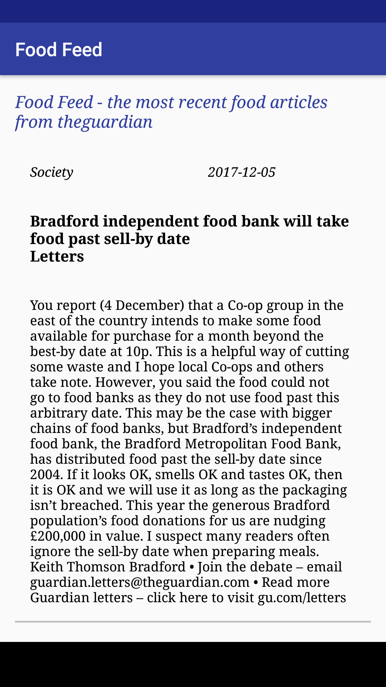

# FoodFeed
View the latest food related stories from The Guardian API.
This was a project for my Udacity Android Beginner's Nanodegree. It involved inflating a listview of parsed stories with the "food" tag from theguardian API. When the user clicks on the article it takes them to the source article at theguardian.com.

